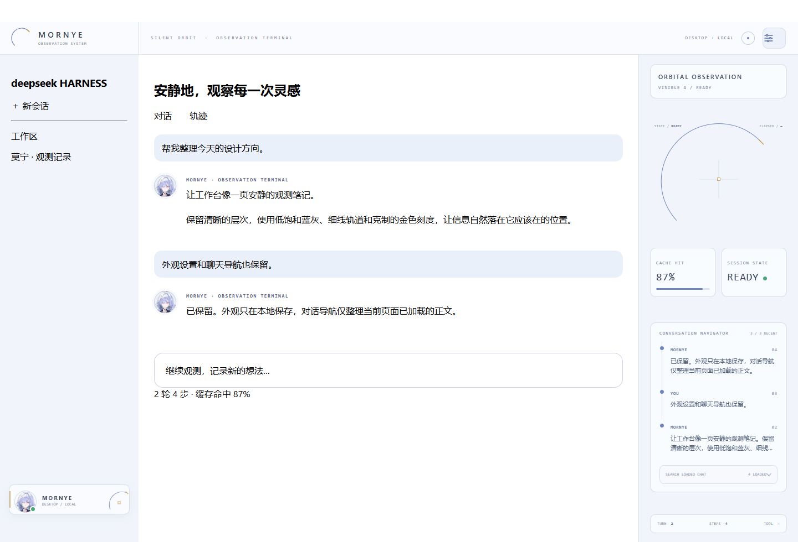

# 莫宁 Observation Skin · 桌面预览版

版本 **0.4.1**，适配 **Windows DeepSeek Harness 桌面预览版 0.1.7-rc.2**。

延续原设计的浅蓝灰工作台、轨道与金色刻度、莫宁身份卡、外观控制器，以及仅在页面内工作的聊天导航。桌面插件使用 DSH 的客户端插件接口，不修改 `app.asar`，不替换官方程序，不依赖浏览器插件或远程脚本。

## 下载

- [下载桌面适配版 ZIP](https://github.com/is-limo/Mornye-Observation-Skin/releases/download/v0.4.1/Mornye-Observation-Skin-Desktop-0.4.1.zip)
- [下载 ZIP 的 SHA-256 校验文件](https://github.com/is-limo/Mornye-Observation-Skin/releases/download/v0.4.1/Mornye-Observation-Skin-Desktop-0.4.1.zip.sha256)

## 安装

1. 使用官方桌面版至少启动一次，初始化 `desktop` 配置。
2. 从应用菜单**退出 DSH**，确认托盘中也已退出。
3. 把 ZIP 解压到一个可写目录，在解压目录打开 PowerShell。
4. 把下列 `D:\dsh` 替换为包含 `DeepSeek Harness.exe` 的实际文件夹，执行：

```powershell
powershell -NoProfile -ExecutionPolicy Bypass -File .\install-desktop.ps1 -DshPath 'D:\dsh'
```

5. 正常启动 `DeepSeek Harness.exe`，在 DSH 设置中使用**浅色主题**。

发行包已经构建好，不需要 Node.js、npm、Python、管理员权限或联网下载依赖。`-ExecutionPolicy Bypass` 只作用于这一子进程，不修改系统执行策略。

若只想先检查版本和包是否完整：

```powershell
powershell -NoProfile -ExecutionPolicy Bypass -File .\install-desktop.ps1 -DshPath 'D:\dsh' -CheckOnly
```

如果自己设置了独立的 DSH 数据目录，额外传入 `-DshHome 'D:\MyDSHData'`。默认依次使用当前进程的 `DSH_HOME`、用户目录下的 `.dsh`。这与 Electron 的 `user-data-dir` 不是同一个目录。

## 使用

- 顶栏右侧的滑杆按钮打开外观设置：三种浅色预设、透明度、强调色与静止模式。
- 宽度达到 **1180 CSS 像素**、处于聊天页且没有打开原生右侧面板时，显示观测栏。Windows 的显示缩放会影响 CSS 像素数。
- 打开原生文件、工具或其他右侧面板时，观测栏自动隐藏并归还空间。窄窗口仍可使用顶栏外观控制。
- 深色模式保留官方布局并隐藏皮肤装饰；切回浅色自动恢复。
- 聊天导航只索引当前页面已加载的用户发言和助手可见正文。点击摘要定位消息；搜索不访问历史数据库、不包含推理区域、代码块或工具输出。
- `DESKTOP / LOCAL` 表示本地桌面界面；不代表网络、API 或模型服务已连接。
- 缓存命中、轮数、步数仅在当前 DSH 页面提供可解析的统计时显示，否则为 `—`。`READY` 表示页面中已有消息，不保证模型服务可用。

## 升级、卸载与恢复

先完全退出 DSH。升级皮肤时先使用旧包的卸载脚本，再安装新包。

```powershell
powershell -NoProfile -ExecutionPolicy Bypass -File .\uninstall-desktop.ps1 -DshPath 'D:\dsh'
```

卸载器不限制官方程序版本，更新 DSH 后也可卸载。未发生其他插件改动时，恢复安装前的 `profiles/desktop/package.json` 原始字节；若之后添加了别的插件，仅移除本皮肤的依赖和 bundle，保留其他改动。

安装只会写入以下位置：

```text
<DSH_HOME>/extensions/dsh-mornye-desktop-skin/
<DSH_HOME>/profiles/desktop/node_modules/dsh-mornye-desktop-skin/
<DSH_HOME>/profiles/desktop/package.json
<DSH_HOME>/profiles/desktop/.mornye-desktop-skin-state.json
```

状态文件保存安装前的 package.json，用于恢复；它只在本机生成，不进入发行包。安装期间短暂使用官方 profile 的 `lock` 文件。不修改 `cordis.patch.yml`、凭据、模型配置、人格提示词或会话。

如果 DSH 插件管理器后来把本插件目录转换成符号链接，脚本会拒绝递归删除该链接。此时使用 DSH 插件管理器卸载，或人工检查链接及其目标后处理。

安装器仅接受 `0.1.7-rc.2`。本版本没有验证其他桌面版本、macOS 或 Linux。官方更新不会改写皮肤代码，但新版本可能改变界面结构；建议更新前先卸载，等待相应适配版。

## 从源码构建与验证

Node.js 22 或更高版本：

```powershell
node scripts/build-desktop.mjs
node tests/mornye-semantic-contract.test.mjs
powershell -NoProfile -ExecutionPolicy Bypass -File tests/desktop-installer.test.ps1
```

浏览器测试使用 Playwright：

```powershell
npm install
npx playwright install chromium
node tests/desktop-runtime.test.mjs
```

也可用 `PLAYWRIGHT_CHANNEL=msedge` 选择已安装的 Edge，或通过 `PLAYWRIGHT_MODULE` 指定现有 Playwright 模块目录。浏览器测试覆盖插件释放与重载、设置持久化、搜索隔离、原生面板优先、窄窗口、深色模式以及减少动态效果。安装器测试使用项目 `work/` 内的假应用和独立配置，不修改个人 DSH 数据。

打包：

```powershell
powershell -NoProfile -ExecutionPolicy Bypass -File scripts/package-desktop.ps1
```

产物在 `dist/releases/`，包含 ZIP、ZIP 校验文件及包内 `SHA256SUMS.txt`。打包采用明确文件清单，不收集 `work/`、用户配置或官方运行时。

0.4.1 已在官方 `0.1.7-rc.2` 的 Electron Node 运行时和独立 desktop profile 中完成插件加载检查，并以无界面浏览器检查真实 DSH 前端；没有自动发送模型请求。下图是包含合成示例内容的布局预览，不是用户聊天截图。



代码采用 [MIT](LICENSE)，角色图片与标识的权利范围见 [ASSETS-NOTICE.md](ASSETS-NOTICE.md)。
